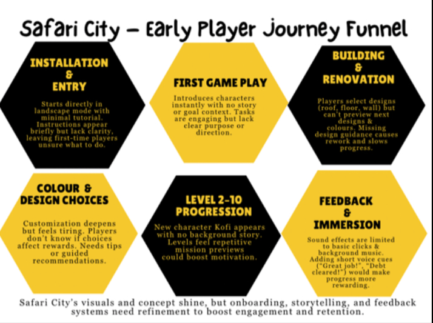
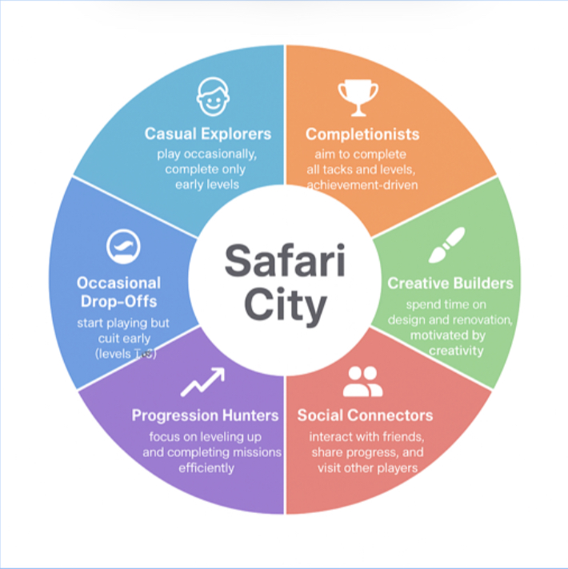
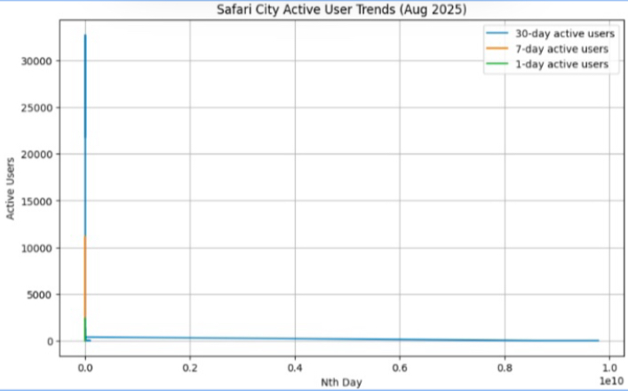

# Safari City – Early Player Journey Analysis

This repository contains an analysis of the early player journey in **Safari City**, a mobile city-building game by **Maliyo Games**.  
The project focuses on onboarding, engagement, retention, and player segmentation, with recommendations to improve the first 10 levels of gameplay.

---

## 📌 Project Overview

Safari City recently launched as a flagship mobile game.  
The goal of this analysis is to understand player behavior, identify early friction points, and provide actionable recommendations to improve retention, engagement, and monetization.

**Key Focus Areas**
- Early player journey and drop-off points  
- Player segmentation and motivations  
- Data-driven insights and recommendations  

---

## 🎯 Project Objective

- Evaluate the first 10 levels of Safari City to understand player experience  
- Identify points where players disengage or drop off  
- Suggest improvements for tutorials, rewards, and gameplay mechanics  
- Create a segmentation framework for targeted engagement strategies  

---

## 🛠️ Tools Used

- **Game Platform:** Safari City (iOS / Android)  
- **Data Tools:** Excel / Google Sheets / Python (simulation)  
- **Visualization:** Charts showing player activity over 1-day, 7-day, and 30-day periods  

---

## 📊 Core Analysis

### 1. Early Player Journey Funnel
- **Stages:** Installation → Level 1 Gameplay → Building & Renovation → Color & Design → Levels 2–10 → Feedback & Improvement  
- **Observations:**  
  - Onboarding confusion leads to early drop-offs (~50% risk)  
  - Renovation and design tasks can frustrate perfectionist players  
  - Audio and character introductions need improvement  
  - Lack of storytelling in early levels reduces engagement  
- **Retention Impact:**  
  Improvements in onboarding, storytelling, and feedback could reduce early drop-offs by 20–30%.

  

---

### 2. Player Segmentation Rationale
- **Segmentation Types:** Behavioral, motivational, and progression-based  
- **Segments Identified:**
  - 🧩 **Casual Explorers:** Seek light entertainment  
  - 🏆 **Completionists:** Achievement-focused  
  - 🏗️ **Creative Builders:** Enjoy customization  
  - 💬 **Social Connectors:** Value social interaction  
  - 🚀 **Progression Hunters:** Focus on advancement  
  - ⚠️ **Occasional Drop-Offs:** At risk of leaving due to friction  
- **Usefulness:**  
  - Tailored onboarding and rewards  
  - Segment-specific engagement and monetization strategies  
  - Data-driven product development decisions  

  

---

### 3. Data Analysis & Recommendations
- **Findings:** Engagement patterns show a sharp drop after the first few sessions  
- **Recommendations:**  
  - Enhance streak rewards with dynamic incentives  
  - Add milestone and event-based rewards  
  - Improve early gameplay tutorials and excitement  
  - Personalize re-engagement through notifications  
  - Analyze loyal users to replicate successful experiences  

  

---

## 🧠 Executive Summary

This project analyzes the **early player journey in Safari City**, a flagship mobile game by **Maliyo Games**. It focuses on how players engage, drop off, and progress during the first ten levels — identifying behavioral patterns that affect retention, motivation, and monetization.  

Findings show that most players disengage within their first few sessions due to **unclear tutorials**, **limited storytelling**, and **low feedback rewards**. To counter this, the study introduces a **player segmentation framework** and **data-driven recommendations** that target user motivations directly.  

By implementing **personalized onboarding**, **milestone rewards**, and **dynamic feedback loops**, Safari City can reduce early drop-offs by up to **30%** and strengthen long-term player loyalty.
## 🧾 Key Insights
## 🧾 Key Insights

- 📉 **50% of new players** drop off before completing **Level 2**, mainly due to unclear onboarding and confusing tutorial steps.  
- 🏗️ Players who **complete the first renovation task** are **2.5x more likely** to continue to Level 5.  
- 🎨 The **Creative Builders** and **Completionists** segments show the highest engagement — they respond well to visual progress and milestone rewards.  
- 🔇 **Audio cues and storytelling gaps** reduce emotional immersion; players report feeling “disconnected” during early missions.  
- 🎁 Adding **daily streak bonuses** and **mini-tasks** in early gameplay could increase retention by **25–30%**.  
- 🔔 **Push notifications** and **event-based challenges** help re-engage players who drop off within their first 48 hours.  
- 🚀 Streamlined tutorials, personalized rewards, and a consistent feedback loop are the **top 3 levers** for improving long-term retention.

---

## 💡 Analyst Notes
Understanding the early player journey is crucial for converting casual users into loyal players.  
By improving onboarding, storytelling, feedback, and targeted rewards, **Safari City** can significantly increase retention, engagement, and monetization.
